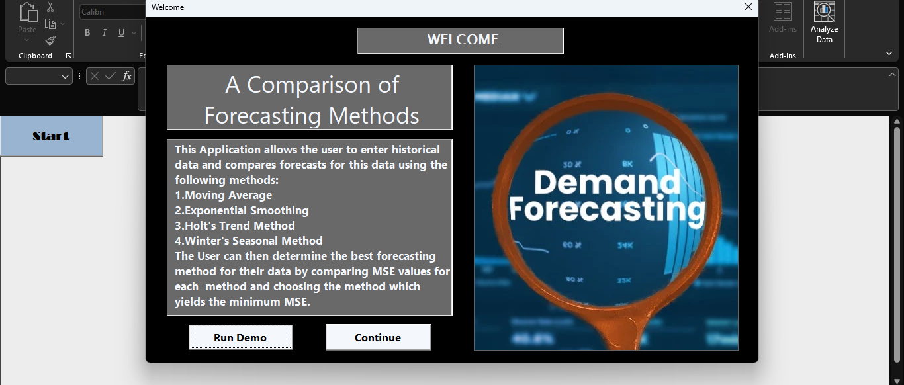
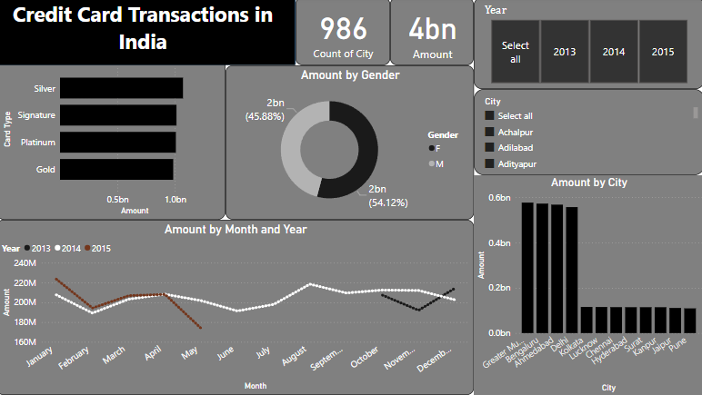

# Data Analyst

### Profile Info
I am Najwan. I am a dedicated and data science enthusiast with a profound interest in machine learning and data analytics. With a strong foundation in mathematics, statistics, and programming, they are passionate about leveraging data-driven insights to tackle complex challenges and drive impactful decision-making processes. As an aspiring Data Scientist Eager to explore the vast realms of artificial intelligence, they continually seek to expand expertise in cutting-edge techniques and methodologies within the field of machine learning. With a keen eye for detail and a natural curiosity for uncovering patterns within data, they are committed to contributing to the advancement of data science and its applications across various industries.

### Education
**Bachelor's Degree in Statistics and Operations Research**
* Statistics
* Mathematics
* Computer Science

**Second Class Honours**

***

### Work Experience
Data Analyst 

**FairFirst Insurance Limited**      

2023 Feb - Present

As a data analyst, I played a pivotal role in collecting, cleaning, and analyzing data to drive strategic decision-making and business growth. I utilized advanced statistical methods and data visualization techniques to uncover insights and trends, presenting findings through comprehensive reports and interactive dashboards. Collaborating closely with cross-functional teams, I translated complex data into actionable recommendations that supported key initiatives and optimized operational efficiency.

***

### Projects

1 . [Body Fat Prediction Using Machine Learning Models](https://github.com/snm-najwan/Uni-Projects/blob/main/Body%20Fat%20Prediction%20using%20ML%20models.pdf)

This is my University final year project. I have used three Machine Learning models to compare which model predict the better for Body Fat which is calculated from Antroprometric measures that involves no digital measures and use easier and non expensive methods to take measurements. For this project I used **Neural Network**, **Multiple Linear Regression**, and **Partial least Squares Regression** and used **R Statistical Software** for this project. As a result of the analysis I got Neural Network as the best model between all three models with 94% accuracy.

2 . [Statistical Analysis in the context of Business Growth](https://github.com/snm-najwan/Uni-Projects/blob/main/Statistical%20Analysis%20in%20the%20context%20of%20Business%20Growth.pdf)

In this project we did analyze the data of an online retail company which operates from United Kingdom. During the past years the company has experienced a gradual increase in the attrition of existing customers which has affected the organizational performance. To identify what factors to focus in retaining the customers by understanding the gaps from organization point of view. For this particular analysis we used **Data mining** to identify the patterns and relationship between the products also Association rule mining was done under the apriori principle with support of 2% and confidence of 70% to find out the products which are bought together by customers most frequently and to group the products which are sharing similarity in selling based on region, country like wise we have used **cluster analysis** especially K - means clustering. We also approched this dataset with **Time Series Analysis** to find the trends and periods.

3 . [VBA User Interface App for Time Series Analysis](https://github.com/snm-najwan/Projects/blob/main/User%20Interface%20App.xlsm)

This is my Excel VBA project. In which I used VBA Userform to create User Interface to perform moving averages (3 ,6 12 point moving averages), Exponential Smoothing, Holt's Trend and Winter's Seasonal method on timely data to predict and visualize trends and seasonality.

4 . [Machine Learning project Housing Price Prediction](https://github.com/snm-najwan/Visualizations/blob/main/housingPricesPrediction.ipynb)

This is a machine learning project where i try to improve the model performance by applying feature scaling (Polynomial Features, Removing Outliers) for housing prices prediction dataset. And able to bring the model performance upto 75.2.

5 . [R Shiny web app for Data Visualization](https://github.com/snm-najwan/Projects/blob/main/web_visualization.R)

I have created a R Shiny Web Visualization for supermarket dataset. It provides interfaces to change the categorical and numerical variable as per the graph type. The relevant dataset for this application to work can be able get from [here](https://github.com/snm-najwan/Projects/blob/main/supermarket_sales%20-%20Sheet1.csv)

6 . [Cluster Analysis to identify country regions with same levels](https://github.com/snm-najwan/Portfolio/blob/main/Cluster_Analysis.ipynb)

This is kaggle dataset. This dataset contains countries and their gdpp, income, life expectancy, child mortality, and import, exports. I have used Kmeans clustering method to identify the countries which are in very low level in aove mentioned terms.

7 . [Binary Image Classification](https://github.com/snm-najwan/Portfolio/blob/main/binary%20classification.ipynb)

In this project I have used images of digits zero, and one to train the model with logistic regression. The dataset is 784 pixels but reduced it to 400 pixel to reduce model complexity.

8 . [House Price Prediction App](https://snm-najwan-ml-projects-housing-price-streamlit-dtt9vn.streamlit.app/)

This is the Housing price prediction app to predict the market price of the Houses in a certain city with including all the necessary requirments like net squared meter, distance from nearest metro, distance from nearest city centre, number of bedrooms, age of the house, and floor number from ground.

***
### Projects (Visualizations)

1 . [Billionaires Analysis](https://github.com/snm-najwan/Visualizations/blob/main/Billionairs.ipynb)

I have used a dataset from Kaggle website to portray top richest people in the world. In this analysis I have used Python Matplotlib package to visualize the data and to get the clear idea which sectors, gender, country, and industry are driven the top richest people in the world.

2 . [European Sales Record](https://public.tableau.com/app/profile/seyyad.najwan/viz/FirstTableauViz_17094577677880/Dashboard1#1)

Here I have published my Tableau visualization which shows the analysis of european sales record. In which to analyze and visualize the products sold and consumed from 2010 to 2017 in european countries.

3 . [Credit Card Transactions in India](https://github.com/snm-najwan/Visualizations/blob/main/Credit%20card%20Transactions%20(India).pbix)

I created an interactive Power BI dashboard from Credit card Transaction details dataset which primarily showing transactions happened in India.

4 . [Real Estate sales in USA States](https://github.com/snm-najwan/Projects/Excel Visualization.mp4)

Here’s dynamic Excel dashboard I created using VBA and Excel Charts. The dashboard is based on a retail sales dataset containing information on orders, products, regions, and profit metrics. VBA was used to automate formatting and streamline updates, while Excel Charts helped visualize key trends across time, products, and regions. It's a practical example of how Excel can turn raw sales data into actionable business insights.
